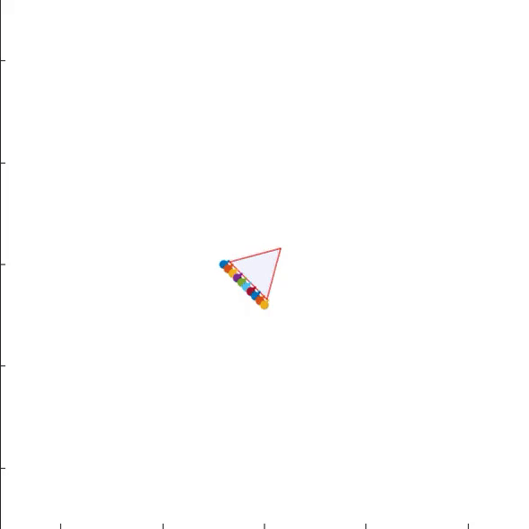

# Safe Coverage of Compact Domains For Second Order Dynamical Systems

This is the repository for the paper [safe coverage of compact domains for second order dynamical systems](https://arxiv.org/pdf/1911.06519.pdf) by Juan Chacon, Mo Chen, and Razvan Fetecau.

## Summary

Autonomous systems operating in close proximity with each other to cover a specified area has many potential applications, but to achieve effective coordination, two key challenges need to be addressed: coordination and safety.

  

For coordination, we propose a locally asymptotically stable distributed coverage controller for compact domains in the plane and homogeneous vehicles modeled with second order dynamics with bounded input forces. This control policy is based on artificial potentials designed to enforce desired vehicle-domain and inter-vehicle separations, and can be applied to arbitrary compact domains including non-convex ones.

We prove, using Lyapunov theory, that certain coverage configurations are locally asymptotically stable. 

For safety, we utilize Hamilton-Jacobi (HJ) reachability theory to guarantee pairwise collision avoidance. Rather than computing numerical solutions of the associated HJ partial differential equation as is typically done, we derive an analytical solution for our second-order vehicle model. This provides an exact, global solution rather than an approximate, local one within some computational domain. In addition to considerably reducing collision count, the collision avoidance controller also reduces oscillatory behaviour of vehicles, helping the system reach steady state faster. 

We demonstrate our approach in several representative simulations involving a convex and non-convex moving domains.
